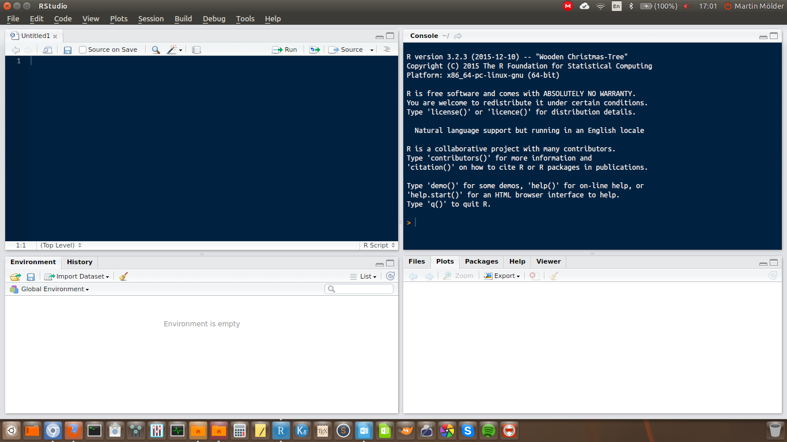

# Getting started with R and RStudio

```{r}
#| label: setup-01
#| include: false
Sys.setlocale("LC_CTYPE", "en_US.UTF-8")
```

This session has three jobs. Get R working on your computer, learn enough of the language to be able to follow everything that comes later, and get `swirl` running, because that is what we use for the practical half of every seminar from here on.

Nothing in this chapter is statistics. It is all groundwork. If you already know some R, skim it and make sure the swirl section at the end works on your machine.

## Why R

R is free, it runs on Windows, macOS and Linux, and it can do essentially any statistical analysis you are likely to need. It is also the standard tool in a large part of the social sciences, which means that when you get stuck, someone has already asked your question online and someone else has answered it.

The difference between R and a point-and-click program like SPSS is not really difficulty — it is that instead of **showing** the program what you want by clicking, you **tell** it by writing the command out. The number of steps is about the same. At the start writing is slower, because you do not yet know the words. Later it is much faster.

There is one advantage that matters more than all the others, and it takes a while to appreciate. Because your analysis is written down as text, you have a complete record of everything you did. You can redo it, correct one step in the middle and rerun it, or hand it to someone else and let them check it. Nothing you do by clicking leaves a record like that.

R by itself is a bare command line. Almost nobody uses it that way. Instead you use it through **RStudio**, which wraps the R console in a proper editor with panels for your files, your plots, your data and your command history.

> **Two programs, not one.** R is the language and the engine. RStudio is the interface you use to work with it. You need both, and you install R **first**.

## Installing R and RStudio

1. Install R from [cloud.r-project.org](https://cloud.r-project.org){target="_blank"}. Pick your operating system and take the latest version.
2. Install RStudio Desktop, the free version, from [posit.co](https://posit.co/download/rstudio-desktop/){target="_blank"}.

If you installed R at some point in the past, update it before going further. Old versions of R cannot install current packages, and the error message you get when this happens does not say so.

When you open RStudio you get something like this:

::: {style="text-align: center"}

:::

Four panels. Two of them matter now.

The **console** is where R actually runs. You can type a command there and press Enter, and R answers immediately. What you type in the console is not saved.

The **script editor** is a text editor for files of R commands. This is where you should do your actual work. To open an empty one: **File → New File → R Script**. Save it with the ending `.R`.

The reason to work in the editor rather than the console is the one above: the file is the record of what you did. The console is for trying things out.

To run a line from the editor, put the cursor on it and press **Ctrl+Enter** (**Cmd+Enter** on a Mac). The line is sent to the console and run there.

> A few more shortcuts worth learning early. Windows first, Mac in brackets.
>
> - **Ctrl+Enter** (**Cmd+Enter**) — run the current line
> - **Ctrl+Shift+Enter** (**Cmd+Shift+Enter**) — run the whole file
> - **Alt+−** (**Option+−**) — insert `<-`, which you will type constantly
> - **Ctrl+Shift+C** (**Cmd+Shift+C**) — comment or uncomment the selected lines
> - **Alt+Shift+K** (**Option+Shift+K**) — show every other shortcut

One setting is worth changing straight away. Under **Tools → Global Options → Code → Editing**, switch on **Soft wrap R source files**. Without it, long lines run off the edge of the screen instead of wrapping.

## R as a calculator

The simplest thing R can do is arithmetic. Type this into the console and press Enter.

```{r}
2 + 4 + 4
```

The `[1]` in front of the answer is not part of the answer. It tells you that the line begins with the first element of the result. With a single number that is not useful, but with a long result printed over several lines it tells you where you are.

The usual operators all work as you would expect.

```{r}
5 * 4
20 / 4
5^0.5
```

`^` raises a number to a power, so `5^0.5` is 5 to the power of one half, which is the square root of 5.

You can also ask R whether something is true. The answer comes back as `TRUE` or `FALSE`.

```{r}
5 > 4
5 == 5
11 != 11
```

Note the **double** equals sign. A single `=` means something else in R, and using it here is one of the most common beginner mistakes. `!=` means "is not equal to"; the `!` means "not" generally.

The full set:

| Operator | Means |
|---|---|
| `<` | less than |
| `>` | greater than |
| `<=` | less than or equal to |
| `>=` | greater than or equal to |
| `==` | equal to |
| `!=` | not equal to |

: {tbl-colwidths="[20,80]"}

## Objects: giving things names

Doing arithmetic one line at a time is not much use. What makes R useful is that you can put a result somewhere and come back to it. A thing with a name is called an **object**.

You create one with `<-`, which you can read as "put into". The arrow points at the name that receives the value.

```{r}
x1 <- 4 + 1
x1
```

Two things happened. The first line calculated `4 + 1` and put the answer into an object called `x1`, printing nothing. The second line is just the name on its own, which tells R to show you what is in it.

That is the general pattern: **assigning is silent, naming is showing.** If you run a line and nothing appears, that is usually because you assigned instead of printed.

Names are up to you, but a few rules and a few habits:

- A name must start with a letter, and can contain letters, numbers, `.` and `_`.
- R distinguishes upper and lower case. `Age` and `age` are different objects.
- Keep names short. You will type them many times, and they end up in tables and on plots where long names break the layout.
- Avoid naming an object after a function that already exists. `data`, `mean`, `sum` and `c` are all real functions, and using them as object names causes confusing problems later.

## Functions

A **function** is a named bundle of instructions. You give it something, it does something to it, and it gives you something back.

Every function is written the same way: its name, then round brackets, then whatever goes in.

```{r}
sqrt(25)
```

`sqrt()` takes a number and returns its square root.

What goes inside the brackets are the function's **arguments**. Many functions take more than one, separated by commas. Most arguments have names, and you give them with `=`.

```{r}
round(3.14159, digits = 2)
```

`round()` rounds a number. Its first argument is the number, and `digits` says how many places after the decimal point to keep. Arguments almost always have sensible defaults, so `round(3.14159)` on its own would round to a whole number.

> **Arguments are where the detail lives.** Throughout this course, when a function appears with an argument you have not seen before, the argument gets explained too. It is usually the argument, not the function, that decides what actually happens.

You will not remember what arguments a function takes, and you are not expected to. Type the function name with an open bracket and press **Tab**, and RStudio lists them. Or read the help page, which is next.

## Getting help

Every function in R has a help page. To see it, put a `?` in front of the name:

```{r}
#| eval: false
?round
```

Help pages are terse and take practice to read. The parts worth looking at first are **Usage**, which shows the arguments and their defaults, and **Examples** at the very bottom, which you can copy and run.

When the help page does not solve it, the realistic order is:

- **Search the web** for the error message, in quotes, along with the word R. Someone has had this problem.
- **Ask a chatbot.** Large language models are genuinely good at R, and very good at explaining what an error message means. Two warnings. They confidently invent functions that do not exist, so run whatever they give you rather than trusting it. And if you paste in code you do not understand and it works, you have not learned anything — which will show up in the final test.
- **Ask me**, or ask on the class forum.

## Vectors

A single number is rarely what you have. Data comes in columns: the age of every respondent, the vote of every respondent. In R a column of values is a **vector**.

You build one with `c()`, which combines values into a vector. The `c` stands for combine.

```{r}
x1 <- c(5, 2)
x1
```

`c()` also combines vectors with each other and with single values:

```{r}
x2 <- 6
x3 <- c(x1, x2, 9, 11, 15)
x3
```

Now the `[1]` marker earns its keep — with a longer vector printed across several lines, each line starts with the position of its first element.

The important property of a vector is that operations apply to **every element at once**. You do not need to write a loop.

```{r}
x3 / 3
x3 + 1
```

And functions work on the whole vector:

```{r}
mean(x3)
```

This is most of what makes R convenient for statistics. "Add one to everyone's age" is `age + 1`, not a set of instructions for stepping through rows.

### Text and factors

Vectors can hold text as well as numbers. Text values go in quotation marks.

```{r}
names <- c("Tom", "Jenny", "Carol", "Fred", "Lisa", "Tom")
names
```

The quotation marks matter. `"Tom"` is the word Tom. `Tom` without quotes would be the name of an object, and R would look for an object called Tom and complain that there is not one.

For a categorical variable — one where the values are categories rather than free text — R has a special type called a **factor**. A factor stores the categories, and separately stores the list of possible categories, which are called its **levels**.

```{r}
names <- factor(names)
names
```

`factor()` converts a vector into a factor. Notice that the quotation marks are gone from the printout, and a new line has appeared listing the levels. `levels()` shows them on their own:

```{r}
levels(names)
```

The levels are in alphabetical order, and there are five of them for six values, because Tom appears twice.

Factors matter more than they look. Whether R treats a variable as a set of categories or as a set of numbers changes what every later function does with it. We come back to this properly in session 2.

### Positions

Every element of a vector has a position, and you can get at an element by asking for its position in square brackets.

```{r}
x3
x3[2]
```

You can also assign to a position, which replaces the value there.

```{r}
x3[2] <- 32
x3
```

## Missing values

Real data has holes in it. A respondent refuses to answer, or the question was never asked in that country. R writes a missing value as `NA`, which stands for "not available".

`NA` is not zero and not blank. It is a marker meaning "there should be a value here and there is not one".

```{r}
x3[1] <- NA
x3
```

The awkward part is what happens when you calculate with it:

```{r}
mean(x3)
```

The answer is `NA`, not a number. This is R being careful rather than R being broken: it does not know what the first value was, so it does not know what the mean is, so it declines to guess.

To get an answer you have to say explicitly what to do about the missing values. Most functions have an argument for it:

```{r}
mean(x3, na.rm = TRUE)
```

`na.rm` stands for "NA remove". Setting it to `TRUE` tells `mean()` to drop the missing values and take the mean of what is left.

> **`TRUE`, not `T`.** You will see `na.rm = T` in a lot of code, including older versions of these materials. It usually works, because `T` is a shortcut for `TRUE`. But `T` is an ordinary object name that can be overwritten, and `TRUE` cannot. Write `TRUE`.

Note what `na.rm = TRUE` actually did: it changed the question. `mean(x3)` asks for the mean of six values, one of which is unknown. `mean(x3, na.rm = TRUE)` asks for the mean of the five values we have. Those are different questions, and which one you want is a decision, not a technicality. Session 2 is largely about making that decision deliberately.

To count how many missing values you have, `is.na()` tests each element and gives back `TRUE` or `FALSE`:

```{r}
is.na(x3)
```

And since R counts `TRUE` as 1 and `FALSE` as 0, adding those up counts the missing values:

```{r}
sum(is.na(x3))
```

## Data frames

A vector is one variable. A whole data set is many variables of the same length, side by side. That is a **data frame**: rows are cases, columns are variables.

`data.frame()` builds one out of vectors. Each argument becomes a column, and the argument's name becomes the column name.

```{r}
data1 <- data.frame(name = names, age = x3)
data1
```

`colnames()` shows the column names, and can also change them:

```{r}
colnames(data1)
```

Because a data frame is two-dimensional, referring to a position now takes two numbers in the square brackets: the row first, then the column, separated by a comma.

```{r}
data1[2, 1]
```

Leaving one of them empty means "all of them". So an empty column position gives you a whole row, and an empty row position gives you a whole column.

```{r}
data1[2, ]
```

```{r}
data1[, 1]
```

> **Rows first, columns second.** Getting this the wrong way round is the single most common source of confusing errors in base R. `data1[2, 1]` is row 2 of column 1; `data1[1, 2]` is row 1 of column 2.

Referring to columns by number is fragile — insert a column and every number shifts. Usually you want a column by name, and for that there is `$`:

```{r}
data1$age
```

This gives back the column as a plain vector, which means everything you learned about vectors applies to it:

```{r}
mean(data1$age, na.rm = TRUE)
```

`$` is the notation you will use most in this course.

## Two more object types, briefly

You will meet these mostly as things R hands back to you, rather than things you build.

A **matrix** is a rectangle of values that must all be of the same type — all numbers, or all text. A data frame allows different types in different columns; a matrix does not. Correlation tables and factor loadings both arrive as matrices, in sessions 9 and 10.

```{r}
values1 <- c(5, 7, 9, 1, 4, 3, 1, 1, 6, 8, 9, 0)
m1 <- matrix(values1, nrow = 4, ncol = 3)
m1
```

`matrix()` takes a vector and arranges it into a rectangle. `nrow` and `ncol` say how many rows and columns to make. Notice that it fills the matrix **down the columns**, not across the rows.

A **list** is the flexible one: it can hold objects of different types and different lengths in the same container. You will not often build one, but almost every statistical model in R gives back a list — the coefficients, the residuals, the fitted values and a dozen other things all bundled together under one name.

```{r}
l1 <- list(country = "Sweden", people = names, values = x3)
l1$country
```

Elements of a list are reached with `$` when they have names, exactly like columns of a data frame.

## Packages

R on its own does a limited amount. Nearly everything specific comes from **packages** — bundles of functions written by other people and shared freely. There are over twenty thousand of them.

Installing a package downloads it to your computer. You do this **once**, ever.

```{r}
#| eval: false
install.packages("ggplot2")
```

The package name goes in quotation marks.

Loading a package makes its functions available. You do this **every time you start R**, so it belongs at the top of your script.

```{r}
#| eval: false
library(ggplot2)
```

Note the inconsistency, which is a wart in R and not something you have got wrong: quotation marks for `install.packages()`, no quotation marks for `library()`.

> If R says `there is no package called 'ggplot2'`, you have not installed it. If it says `could not find function "ggplot"`, you have installed it but not loaded it. These are different problems with different fixes.

Occasionally a package will fail to install with a long and cryptic error, most often on Linux or macOS. This usually means something outside R is missing. Search the error message, or ask.

## Where your files live

R always has a **working directory** — the folder it looks in when you ask it to open a file, and the folder it writes to when you save one. If R cannot find a file you know exists, the working directory is nearly always the reason.

`getwd()` tells you where you are:

```{r}
#| eval: false
getwd()
```

You can set it with `setwd()`, giving the path in quotation marks:

```{r}
#| eval: false
setwd("C:/Users/marti/Documents/QM")
```

Use forward slashes, even on Windows, where the operating system itself uses backslashes.

But there is a better way, and I would rather you used it: an **RStudio Project**. Go to **File → New Project → New Directory → New Project**, and pick a folder for this course. RStudio creates a `.Rproj` file there.

From then on, opening that file opens RStudio with the working directory already set to that folder. You never write `setwd()`, and your scripts work on someone else's computer, which they do not if a path to your own Documents folder is baked into line 1.

Make a project for this course now, with a `data` folder inside it, and put the course data files there.

## Writing a script you can come back to

Two habits, both about your future self.

**Comment your code.** Anything after a `#` on a line is ignored by R. Use it to say *why* you did something — what the code does is visible from the code itself.

```{r}
# Drop respondents who did not vote: they have no party to analyse.
```

**Keep the housekeeping at the top.** Loading packages and loading data go at the beginning, so that anyone opening the file — including you in three weeks — can see immediately what it needs.

```{r}
#| eval: false
# Packages
library(ggplot2)

# Data
swe <- readRDS("data/swe.rds")

# Preparing the data

# Analysis
```

Anyone opening the file — including you in three weeks — can then see at a glance what it needs and roughly how it is organised.

::: {.discussion}
**A question.** You open a script you wrote last month. It begins with `setwd("C:/Users/marti/Desktop/analysis")` and `data <- read.csv("results.csv")`. You now have the file on a different computer, in a different folder, and there is an object in your environment called `data` from something else you were doing.

Which of these will fail, which will silently do the wrong thing, and which is worse?
:::

## swirl

The second half of every seminar from now on is a `swirl` lesson. `swirl` is a package that turns the R console into an interactive tutorial: it asks you to do something, you type the command, and it tells you whether it worked before moving on. You are doing real work in a real console the whole time, which is why it is worth more than watching me type.

Install it once:

```{r}
#| eval: false
install.packages("swirl")
```

Then load it, as you would any package:

```{r}
#| eval: false
library(swirl)
```

The course lessons are not on the internet — you get them from Moodle as a single `.zip` file. Download it, put it in your project folder, and install it with `install_course_zip()`, giving it the path to the file in quotation marks:

```{r}
#| eval: false
install_course_zip("Quantitative_Methods_I.zip")
```

You do this once, and again whenever a new version is posted. To start:

```{r}
#| eval: false
swirl()
```

`swirl` then asks your name, offers you the course, and offers the lessons in it. Pick the one for that week's session.

Some things worth knowing before you start:

- Type `skip()` to skip a question you are stuck on, and `play()` to break out and experiment in the console. `nxt()` returns you to the lesson.
- Type `bye()` to leave. Your progress is saved, and you resume where you stopped.
- `info()` lists these commands whenever you forget them.
- If `swirl` seems stuck, press Esc, then type `swirl()` again.

::: {.swirl}
**In the seminar.** `swirl` lesson 1, *Getting Started*. Working with the console, objects, vectors, and missing values. Around 30 minutes.

Bring a laptop with R, RStudio and `swirl` already installed — installation is not what the half hour is for.
:::
